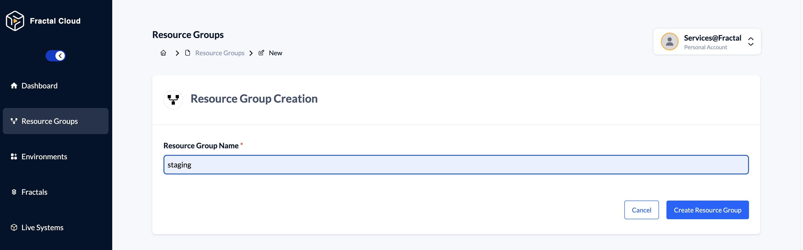
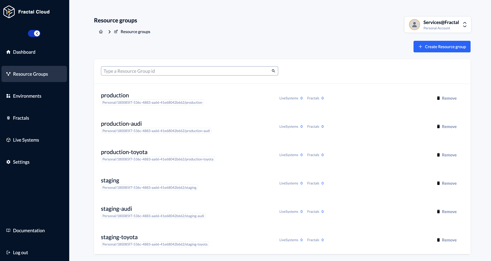

# Automotive sample

This sample demonstrates the simplicity of defining and using fractals, deploying them on multiple cloud vendors.
For simplicity, we have condensed the work of three different teams in one single repo, namely:

* The Infrastructure Specialists own the Cloud Environments and its representation contained in the `infrastructure` folder;
* The DevEx / Architecture teams own the different Fractals ensuring Enterprise guardrails are continuously followed. Their representation is contained in the `architecture` folder;
* The Development Teams own the actual application, which is contained in the `application` folder.

By studying the content of those folders you will be able to get a good idea of how Fractal Cloud simplifies the work day of both, Dev and Ops people at scale.

## How to run

To make this sample work for your free account on Fractal Cloud, you need to do the following:

### Infrastructure Specialists:

1. Register an account on [Fractal Cloud](https://fractal.cloud)
2. Create a `secrets` folder in the root of this repo
3. Initialize a Service account for your user, as shown in the screenshot below, and create the related secret files in the `secrets` folder, namely `cicdServiceAccountName.key` and `cicdServiceAccountPrivateKey.key`. 
4. Create six resource groups on Fractal Cloud as shown in the screenshot below. 
5. Create an Azure Service Principal as explained in the [docs](https://docs.fractal.cloud/how-tos/fractal-cloud-agent-initialization/#microsoft-azure-initialization) and create the related secrets files in the `secrets` folder, namely `azureServicePrincipalClientId.key` and `azureServicePrincipalClientSecret.key`.
6. Create a GCP Service Account as explained in the [docs](https://docs.fractal.cloud/how-tos/fractal-cloud-agent-initialization/#create-the-gcp-service-account) and create the related secrets files in the `secrets` folder, namely `gcpServiceAccountEmail.key` and `gcpServiceAccountCredentials.key`.
7. Add two files to the `secrets` folder named `sourceControlSshKey.key` and `sourceControlSshKeyPassphrase.key` containing an SSH Key and relative passphrase. These will be used to initialize your environments and the relative CI/CD Profiles that will be able to be used to access you git repositories.
8. As last step, you need to modify the configuration in the file `cloud/fractal/samples/automotive/environment/Constants.java`